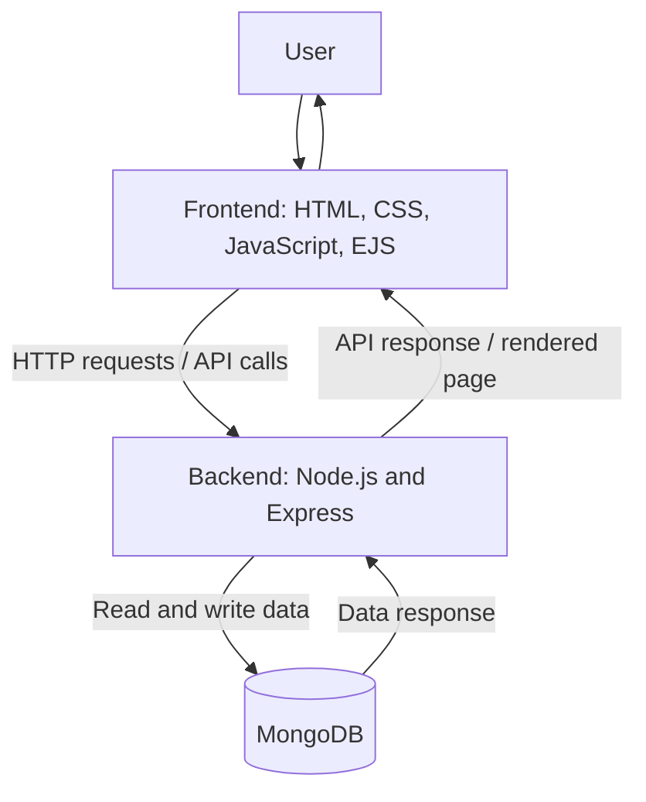

# FarmCart — System Architecture

```mermaid
flowchart TD
    User[User]
    Frontend[Frontend: HTML, CSS, JavaScript, EJS]
    Backend[Backend: Node.js and Express]
    Database[(MongoDB)]

    User --> Frontend
    Frontend -->|HTTP requests / API calls| Backend
    Backend -->|Read and write data| Database
    Database -->|Data response| Backend
    Backend -->|API response / rendered page| Frontend
    Frontend --> User
```